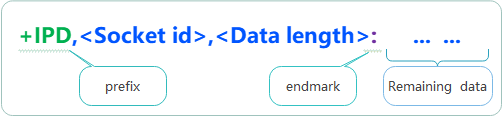

# 进阶功能

完成[普通查询与控制](usage.md)后，按业务需要使用本页能力。首次接入不必同时启用全部功能。

## 多阶段交互

发送网络载荷等操作通常需要多个步骤：发命令、等提示符、发数据、等确认。拆成独立请求可能让其他命令插入中间。`at_do_work` 让一个作业保持执行位置，直到整个过程结束。

作业函数类型为 `int (*)(at_env_t *)`：返回 0 表示下次继续，返回非零表示结束；调用 `env->finish` 也会结束作业并记录结果。它没有普通命令的自动匹配、重试和完成回调，需要业务自行实现。

| 环境成员 | 用途 |
| --- | --- |
| `state`、`i`、`j` | 作业启动时清零的状态变量 |
| `obj`、`params` | 当前对象与业务参数 |
| `println` | 格式化发送并追加 CRLF |
| `recvbuf`、`recvlen`、`recvclr` | 访问和清空接收内容 |
| `contains` | 搜索文本关键词 |
| `reset_timer`、`is_timeout` | 为阶段设置超时 |
| `next_wait` | 延迟下一次作业调用，接收轮询仍继续 |
| `finish` | 标记结束及结果，不调用普通请求回调 |

以下是最小状态机结构，具体解析和业务通知由应用补充：

```c
#include "at_chat.h"

static int query_work(at_env_t *env)
{
    if (env->state == 0) {
        env->recvclr(env);
        env->println(env, "AT+CSQ");
        env->reset_timer(env);
        env->state = 1;
    } else if (env->contains(env, "ERROR")) {
        env->finish(env, AT_RESP_ERROR);
    } else if (env->contains(env, "+CSQ:") && env->contains(env, "OK")) {
        /* 在这里解析结果并通知业务层。 */
        env->finish(env, AT_RESP_OK);
    } else if (env->is_timeout(env, 1000)) {
        env->finish(env, AT_RESP_TIMEOUT);
    }
    return 0;
}

bool submit_custom_query(at_obj_t *at, void *params)
{
    return at_do_work(at, params, query_work);
}
```

扩展为多阶段时，在 state 中区分等待提示符、发送载荷和等待确认，每个阶段设置自己的超时。不要在函数中阻塞等待，也不要为 `println` 重复添加换行。

接收二进制载荷应按协议长度与 `recvlen` 判断完整性，不能依赖 `contains`。取消后核心会跳过已终止作业的处理函数，因此不能仅靠 `env->disposing()` 分支清理业务资源。

## URC 消息处理

启用 `AT_URC_WARCH_EN`，给对象配置非零 `urc_bufsize`，再注册长期有效的订阅表。每项指定前缀、结束字符和处理函数：

```c
#include "at_chat.h"
#include <stdio.h>

#if AT_URC_WARCH_EN
static int power_report(at_urc_info_t *info)
{
    int value;
    if (info->status == URC_RECV_OK &&
        sscanf(info->urcbuf, "+POWER:%d", &value) == 1) {
        printf("power=%d\n", value);
    }
    return 0;
}

void register_power_report(at_obj_t *at)
{
    static const urc_item_t table[] = {
        {.prefix = "+POWER:", .endmark = '\n', .handler = power_report},
    };
    at_obj_set_urc(at, table, (int)(sizeof(table) / sizeof(table[0])));
}
#endif
```

结束字符应在 `AT_URC_END_MARKS` 中。解析器按表顺序采用第一个子串前缀匹配项，订阅规则要避免相互包含或过于模糊。

### 不定长度 URC



对于 `+IPD,<id>,<length>:<payload>`，可以先在冒号处触发回调，读取头部中的长度，再返回尚缺少的字节数。

- 返回 0：这条消息处理完成。
- 返回正数：继续收取指定字节数，再次回调。
- 再次回调提供累计缓冲区和总长度，不只是新到达部分。
- `URC_RECV_TIMEOUT` 表示接收超时，业务应放弃本帧并清理状态。

验证头部、长度及容量后再计算剩余字节数，不返回负数。完整帧必须能放入 URC 缓冲区并留终止空间，溢出时核心直接重置。二进制阶段按 `urclen` 处理，不能假定有 NUL 终止符。

`at_obj_urc_set_enable(at, 0, timeout_ms)` 暂停匹配，时间过去后的后续输入使其恢复；也可用 `at_obj_urc_set_enable(at, 1, 0)` 主动恢复。暂停期间输入仍进入命令响应路径，不会留存为待重放的 URC。

## 作业上下文

启用 `AT_WORK_CONTEXT_EN` 后，可以为请求绑定 `at_context_t`，从主循环观察完成状态，并将响应复制到应用缓冲区：

```c
#include "at_chat.h"
#include <stdio.h>

#if AT_WORK_CONTEXT_EN
static at_context_t context;
static unsigned char response[128];
static bool pending;

bool start_tracked_query(at_obj_t *at)
{
    if (pending) {
        return false;
    }
    at_attr_t attr;
    at_attr_deinit(&attr);
    at_context_init(&context, response, sizeof(response));
    at_context_attach(&attr, &context);
    pending = at_send_singlline(at, &attr, "AT+CSQ");
    return pending;
}

void check_tracked_query(void)
{
    /* 在拥有对象的主循环完成本次轮询之后调用。 */
    if (pending && at_work_is_finish(&context)) {
        response[context.resplen] = '\0';
        printf("result=%d\n", (int)at_work_get_result(&context));
        pending = false;
    }
}
#endif
```

这个例子面向单线程普通完成流程。上下文与缓冲区必须覆盖请求的完整生命周期，不允许多个未完成请求共享同一个上下文。

核心最多复制 `bufsize - 1` 字节，不补 NUL。示例因此在完成后自行终止字符串。若只观察状态，可传 `NULL` 存储和 0 大小；非空存储必须有正容量。取消立即更新状态，但回收仍需轮询，不能看到终止状态就忽略尚存的其他访问。

## 线程与同步等待

适配器的锁只保护部分队列操作，不保证所有接口和全局内存计数都线程安全。让一个任务拥有对象，其他任务通过消息队列交给它处理，通常更容易保证调用顺序。

如果业务需要同步等待，由独立任务持续轮询，完成回调复制结果后发送事件或信号量。每个并发请求需要独立状态和正确同步；提交失败则直接返回，不能继续等回调。

等待方超时不代表底层作业已经停止。退出等待前需要协调取消和资源生命周期；取消、销毁没有普通完成回调，应用必须单独通知等待方。不能在轮询任务或其回调中等待同一对象继续工作。

## 透传

启用 `AT_RAW_TRANSPARENT_EN` 后，`at_raw_transport_enter(at, conf)` 将对象切换成双向数据转发。配置必须长期有效：

| 读取端 | 写入端 |
| --- | --- |
| `adap->read`，设备侧 | `conf->write`，透传侧 |
| `conf->read`，透传侧 | `adap->write`，设备侧 |

透传期间核心不推进普通命令队列，也不解析 URC。进入前应协调业务空闲；已有请求不会自动取消，退出后可能继续执行或超时。

`exit_cmd` 在透传侧输入中按行匹配，忽略大小写，CR 或 LF 结束一行。匹配后只调用 `on_exit`，应用必须调用 `at_raw_transport_exit(at)` 才退出。退出命令检测前数据已经发往设备，不会被自动拦截。

## 内存与多实例

每个对象有独立的队列、当前作业、接收缓冲区和 URC 表。不同设备需要分别绑定读写函数，并分别轮询；适配器没有实例参数，通常使用不同包装函数绑定不同串口。

内存统计和限制是全局共享的。`at_cur_used_memory` 返回当前组件分配统计，`at_max_used_memory` 返回历史峰值，包括对象、缓冲区、作业、临时格式化空间和内部计数头，不等于整个系统堆占用。

当前限制判断未完整计入本次计数头，因此统计值可能略超 `AT_MEM_LIMIT_SIZE`。应结合峰值调整缓冲区和业务提交频率，并始终检查分配或提交结果。
