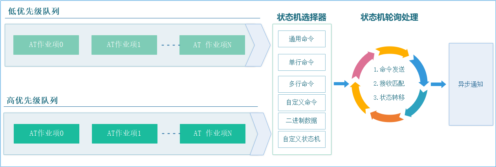
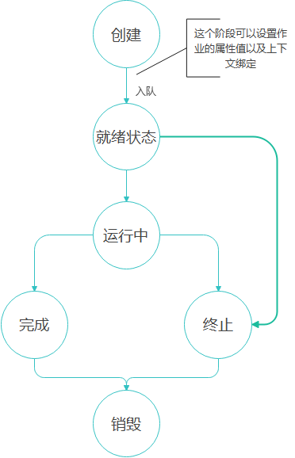
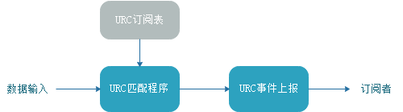

# 框架工作原理

AT-client-cmd 把设备通信拆成两件事：应用提交“要执行的命令”，框架在后续轮询中完成发送、等待响应和结果通知。应用不用为每一条普通 AT 命令编写等待循环。

这套文档按实际接入顺序展开：

1. **本文**：理解对象、请求、轮询、响应和 URC 之间的关系。
2. **[平台移植与设备驱动对接](porting.md)**：把框架接到你的时钟、内存和串口驱动上。
3. **[查询与控制设备](usage.md)**：使用 `at_commands_sample.c` 查询设备，再扩展自己的指令。

[命令接口参考](api-reference.md)用于查参数和生命周期，[进阶功能](advanced-usage.md)用于处理多阶段交互、主动上报及线程协作。

## 应用、框架和驱动分别负责什么

| 层次 | 负责的内容 | 不由这一层决定的内容 |
| --- | --- | --- |
| 应用 | 选择命令、解释响应、更新设备状态 | 字节具体如何经过串口发送 |
| AT 框架 | 请求排队、状态推进、响应匹配、超时重试 | 设备支持哪些命令、字段的业务含义 |
| 平台驱动 | 串口配置、收发队列、中断或 DMA、时钟和内存 | 一条业务请求是否成功 |

框架不会初始化串口，也不会自动创建任务。`at_obj_create` 创建的是通信管理对象；应用仍需调用 `at_obj_process` 才能推进通信。

## 一个对象管理一条通信通道

`at_obj_t` 保存这条通道的请求队列、当前作业和接收状态。创建对象时传入 `at_adapter_t`，其中的 `read` / `write` 决定数据从哪里来、到哪里去。

一个对象可以排队多个请求，但同一时刻只执行一个作业。多个物理设备通常分别创建对象，并绑定各自的驱动接口。

适配器由应用提供，框架只保存其指针。因此示例把适配器定义为 `static const`，使其在对象存在期间始终有效。

## 从提交到收到结果

以查询蓝牙地址为例，应用提交 `AT+LBDADDR?` 后会经历以下过程：

1. **入队**：发送接口分配一个作业，复制属性，保存命令信息并加入队列。此时返回 `true`，表示提交成功。
2. **发送**：轮询选中该作业后，通过驱动写接口发送命令。普通命令接口自动追加 CRLF。
3. **接收**：后续轮询从驱动取出字节，并累计到响应缓冲区。
4. **判断**：普通命令状态机检查响应前缀、后缀、错误标记和超时条件。
5. **通知与回收**：通过请求回调报告结果，回收作业内存，再继续处理后面的请求。



**入队成功和设备执行成功是两个不同的时刻。** 只有收到并验证响应之后，应用才能确认查询或控制的结果。入队失败不会产生该次请求的完成回调。

## 轮询驱动状态机

每次普通 `at_obj_process` 最多从驱动读取 64 字节，交给接收处理，再推进当前作业。它不会等待设备发完一整帧才返回。

没有当前作业时，先选择高优先级队列，否则选择低优先级队列。同一优先级按提交顺序执行；高优先级不会打断已经开始的作业。持续提交高优先级请求可能使低优先级请求长期等待。



轮询需要持续执行。轮询过慢会延迟响应处理，并可能使驱动接收队列溢出；在回调中阻塞等待另一条命令，则会让同一对象无法继续推进。

`at_work_abort_all` 将作业标记为终止，随后仍要轮询回收。当前实现不会对取消的作业调用普通完成回调；销毁对象同样不会逐项通知。需要取消通知时，由应用自行安排。

## 框架怎样识别响应

框架不认识“蓝牙地址”这个业务字段，只按应用指定的字符串规则判断响应是否到齐。例如：

```text
命令：AT+LBDADDR?
前缀：+LBDADDR
后缀：OK
```

普通命令在缓冲区中搜索前缀，再从前缀处向后搜索后缀。成功后把匹配位置交给回调，应用按设备协议解析实际字段。

超时表示规定时间内没有得到满足条件的响应，可能来自设备无响应，也可能来自驱动丢字节或匹配规则不正确。框架不会自动判断是哪一种原因。

## 设备主动上报的消息

URC（Unsolicited Result Code，非请求结果码）是设备主动上报的消息。主机不需要先发送对应查询，设备会在上电、连接状态变化或收到数据等事件发生时主动通知主机。

例如，模组上电后自动返回 `+IM_READY`，就是在通知主机启动状态。是否代表全部业务功能就绪，应以模组手册为准。

### 与指令响应有什么区别

| 类型 | 交互过程 | 框架中的处理位置 |
| --- | --- | --- |
| 指令响应 | 主机发送 `AT`，模组随后返回 `OK` | 该请求的完成回调 |
| URC 主动上报 | 模组上电，自动发送 `+IM_READY` | 注册的 URC 处理函数 |

URC 可以在没有待处理指令时到达，也可以穿插在指令响应之间。不能只凭消息是否以 `+` 开头判断：例如查询返回的 `+BAUD:115200` 也可能是普通响应的一部分，要结合设备协议和交互上下文区分。

### 常见消息样式

以下展示启动通知及其他常见消息样式。名称与字段应以模组手册为准：

| 样式 | 消息示例 | 表达的信息 |
| --- | --- | --- |
| 固定文本 | `+IM_READY` | 上电或启动通知 |
| 文本事件 | `WIFI DISCONNECT` | 网络连接断开 |
| 带数值字段 | `+POWER:80` | 上报某项状态数值，单位由协议定义 |
| 带多个字段 | `+LINK:1,CONNECTED` | 某个连接的状态变化 |
| 带长度和数据 | `+IPD,0,5:hello` | 某通道收到指定长度的数据 |

文本行常以 CRLF（`\r\n`）结束。例如实际收到的字节可能是 `+IM_READY\r\n`，其中 `\r\n` 表示回车和换行，不是消息中的四个可见字符。

结束符必须核对模组协议；带数据的消息还可能包含二进制载荷，需要按长度接收。

应用通过 URC 订阅表指定前缀、结束字符和处理函数。对 `+IM_READY\r\n`，可匹配前缀 `+IM_READY`，以 `\n` 为结束字符；完整消息到达后通知业务层。



URC 和命令响应共享输入数据：当前代码会将同一批字节送入两个解析路径，不会把识别到的 URC 自动从命令响应缓冲区中移除。响应规则应足够明确，避免误匹配。

没有待发送命令时也应继续轮询，才能及时接收主动消息。

启动通知和数值上报的接入片段见 [at_urc_sample.c](../samples/at_urc_sample.c)。URC 的注册和不定长数据接收见[进阶功能](advanced-usage.md#urc-消息处理)。

## 接入前记住三点

- 让一个执行上下文持续轮询同一个对象，回调及时返回。
- 检查提交结果，在完成回调中处理设备结果。
- 异步请求引用的数据不能提前失效，需要延后使用的响应应在回调中复制。

接下来按[平台移植与设备驱动对接](porting.md)建立实际通信通道。公开接口和实现分别位于 [at_chat.h](../include/at_chat.h) 与 [at_chat.c](../src/at_chat.c)。
