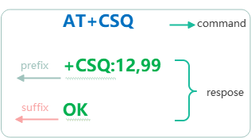

# 查询与控制设备

将[驱动对接](porting.md)中的片段接入应用后，确认 AT 对象初始化成功并持续轮询。本篇从现成的蓝牙查询开始，说明如何提交请求、接收结果，再添加自己的控制指令。

## 先确认设备的指令格式

框架不会自动选择设备协议。提交前，需要确认命令文本、成功响应、错误标记和响应时间。

[at_commands_sample.c](../samples/at_commands_sample.c) 展示以下指令接口，按需放入业务模块并在应用头文件中声明：

| 接口 | 发出的命令 | 回调标识 | 超时 / 重试 |
| --- | --- | --- | --- |
| `at_device_check_ready()` | `AT` | `ready` | 1200ms / 0 |
| `at_device_query_address()` | `AT+LBDADDR?` | `bdaddr` | 1200ms / 1 |
| `at_device_query_baudrate()` | `AT+BAUD?` | `baudrate` | 1200ms / 1 |
| `at_device_set_baudrate(uint32_t baudrate)` | `AT+BAUD=<baudrate>` | `set_baudrate` | 1200ms / 0 |
| `at_device_set_output(uint32_t value)` | `AT+OUTIO=<value>` | `output` | 1200ms / 0 |

重试列表示首次发送后的额外尝试次数。两条查询为高优先级，其余使用默认低优先级。所有接口均返回入队结果，最终状态在回调中报告。

蓝牙地址查询匹配 `+LBDADDR` 和 `OK`，波特率查询匹配 `+BAUD` 和 `OK`。探测与控制等待 `OK`。先核对模块支持的命令、参数和响应格式，再使用对应接口。



## 先验证基本通信

驱动初始化成功后，先调用 `at_device_check_ready()`。它发送 `AT`，等待 `OK`，超时 1200ms，不自动重试。返回 `true` 只说明入队成功；继续轮询并等待 `ready` 回调成功后，再提交设备专用查询。

不要在同一时刻把探测和高优先级查询全部提交，否则高优先级查询可能先于探测执行。

## 提交第一组查询

在业务事件中调用以下函数，例如设备进入 AT 模式后或用户按下查询按钮时：

```c
#include "at_chat.h"

/* Include the application declarations for the at_device_* snippets. */
#include <stdio.h>

void app_query_device(void)
{
    if (!at_device_query_address()) {
        printf("Address query was not queued\n");
    }
    if (!at_device_query_baudrate()) {
        printf("Baud rate query was not queued\n");
    }
}
```

两条查询使用独立的常量字符串，可以连续入队。第二条提交失败不会撤销第一条，因此每个返回值都要检查。

提交后继续运行主循环中的 `at_device_process()`。不要在每一轮循环里重新提交，也不要等待第一条命令完成后才继续轮询。

## 接收与处理结果

`at_commands_sample.c` 展示结果回调的处理方式。将所需解析和通知逻辑放入应用业务模块；`query` 使用上表中的回调标识，区分探测、查询和设置请求。

```c
#include "at_chat.h"

/* Include the application declarations for the at_device_* snippets. */
#include <stdio.h>

void at_device_on_response(const char * query, at_response_t * resp_p)
{
    if (resp_p->code != AT_RESP_OK) {
        printf("%s failed: %d\n", query, (int)resp_p->code);
        return;
    }

    printf("%s response: %.*s\n", query,
           (int)resp_p->recvcnt, resp_p->recvbuf);
    /* Parse and copy the required fields here before returning. */
}
```

实际例程通过 `at_parse_baudrate` 检查 `+BAUD:` 行，仅接受大于 0 且不超过 `UINT32_MAX` 的十进制数值，拒绝负数、溢出和尾随非空白字符，并输出明确的格式错误。若设备返回枚举编号，应替换解析规则。先检查框架结果，再解析字段。`AT_RESP_OK` 表示匹配规则成立，字段是否符合业务要求还要继续校验。蓝牙地址的分隔符、长度，以及波特率字段是数值还是枚举，都应以设备协议为准。

响应对象和缓冲区会在回调后失效或被复用。需要更新界面或交给其他任务时，在回调中解析并复制结果，不要把 `resp_p` 或其中的缓冲区指针直接保存起来。

如果设备需要切换 AT 模式，应在整组请求完成后再协调退出，避免第一条响应回调关闭了后续请求需要的通道。

## 添加自己的查询

取得当前对象，初始化属性，然后填写命令和响应规则。以下以支持 `AT+CSQ` 的设备为例：

```c
#include "at_chat.h"

#include <stddef.h>

/* Include the application declarations for the at_device_* snippets. */

bool app_query_signal(at_callback_t callback)
{
    at_obj_t * device_p = NULL;
    at_attr_t attr;

    if (!at_device_get_object(&device_p)) {
        return false;
    }

    at_attr_deinit(&attr);
    attr.prefix   = "+CSQ:";
    attr.suffix   = "OK";
    attr.cb       = callback;
    attr.timeout  = 1000;
    attr.retry    = 0;
    return at_send_singlline(device_p, &attr, "AT+CSQ");
}
```

调用者提供 `void callback(at_response_t *)` 类型的函数处理结果。`at_attr_deinit` 实际用于初始化默认属性，调用之后再覆盖需要的字段。

`at_send_singlline` 只有三个参数：对象、属性、命令。它保存命令字符串指针，因此这里使用字符串常量；临时拼接的字符串应改用格式化接口，或确保其在请求结束前一直有效。

## 发送带参数的控制指令

`at_commands_sample.c` 中的 `at_device_set_baudrate(baudrate)` 演示参数传入、检查和格式化发送：

```c
#include "at_chat.h"

#include <stdint.h>

/* Include the application declarations for the at_device_* snippets. */
#include <stdio.h>

void app_set_device_baudrate(void)
{
    if (!at_device_set_baudrate(UINT32_C(115200))) {
        printf("Baud rate setting was not queued\n");
    }
}
```

该调用通过 `at_exec_cmd(device_p, &attr, "AT+BAUD=%" PRIu32, baudrate)` 生成 `AT+BAUD=115200`，发送时自动追加 CRLF。参数为 0 或对象未初始化时返回 `false`；设备最终结果由独立回调以 `set_baudrate` 标识报告。格式化结果由框架复制，不需要共享命令缓冲区。

`AT+BAUD=<数值>` 仅作为指令格式示例，必须核对目标模块支持的语法和取值。设备可能立即切换波特率，应按协议安排主机串口切换；示例不自动调整 UART，也不重发这条设置指令。

`at_commands_sample.c` 提供 `at_device_set_output(value)`，演示用 `at_exec_cmd` 发送 `AT+OUTIO=<value>`，结果交给 `at_device_on_response("output", response)`。该命令只是演示，使用前应替换为目标设备支持的控制指令。

`at_exec_cmd` 按 printf 格式生成命令并复制结果。下面的 `AT+OUTIO` 只演示参数用法，必须替换为目标设备实际支持的控制命令：

```c
#include "at_chat.h"

#include <stddef.h>

/* Include the application declarations for the at_device_* snippets. */

#include <inttypes.h>

bool app_set_output(uint32_t value, at_callback_t callback)
{
    at_obj_t * device_p = NULL;
    at_attr_t attr;

    if (!at_device_get_object(&device_p)) {
        return false;
    }

    at_attr_deinit(&attr);
    attr.cb       = callback;
    attr.timeout  = 1000;
    attr.retry    = 0;
    return at_exec_cmd(device_p, &attr, "AT+OUTIO=%" PRIu32, value);
}
```

默认后缀为 `OK`。如果设备以其他内容确认，应修改 `attr.suffix`。收到并验证成功响应后再更新应用状态，不能将返回 `true` 当作控制已执行。

查询通常可以重发；对于切换、扣减或其他不可重复执行的操作，应关闭自动重试，或者按设备协议设计去重。

普通命令接口自动追加 CRLF，不需要在字符串末尾再加 `\r\n`。格式化结果须小于 `AT_MAX_CMD_LEN`，当前实现不安全处理超长格式化结果。其他接口及数据规则见[命令接口参考](api-reference.md)。

## 参数类型与格式化

例程的波特率和控制参数使用 `uint32_t`，类型定义来自 `<stdint.h>`。打印或构造指令时使用 `<inttypes.h>` 中的 `PRIu32`，例如 `"AT+BAUD=%" PRIu32`；不要假定 `uint32_t` 在所有平台上都对应 `unsigned int`。

`UINT32_C(115200)` 表示适合 32 位无符号类型的常量。参数值必须符合设备协议，类型范围并不代表设备支持全部取值。设置波特率时，例程先拒绝 0，再提交请求。

接收解析先用 `strtoumax` 读取到 `uintmax_t` 临时变量，确认没有溢出且值在 1～`UINT32_MAX` 范围后，才转换成 `uint32_t`，避免先截断再检查。

## 从现象定位问题

| 现象 | 检查顺序 |
| --- | --- |
| 提交返回 `false` | 对象是否初始化成功 → 内存是否足够 → 请求是否提交过快 |
| 请求入队但不发送 | 是否持续轮询 → 当前作业是否结束 → 是否处于透传模式 |
| 发送后总是超时 | 驱动是否收到字节 → 波特率和设备模式 → 前后缀 → 超时配置 |
| 收到内容但解析失败 | 输出实际长度与内容 → 按设备文档核对字段格式 |
| 两条指令互相干扰 | 是否复用可变命令缓冲区 → 是否提前退出 AT 模式 → 是否存在其他串口读者 |
| 回调没有发生 | 提交是否成功 → 是否被取消或销毁 → 回调是否配置 |

`at_device_is_busy()` 反映请求或 URC 处理状态，不等于设备连接状态。当前取消与销毁路径没有普通完成回调，应用需要自行通知取消结果。

## 下一步按业务选择

- 多条独立初始化指令：查阅[批量命令](api-reference.md#批量命令)。
- 先等提示符再发数据：使用[自定义作业](advanced-usage.md#多阶段交互)。
- 设备主动上报状态或数据：注册[URC 处理](advanced-usage.md#urc-消息处理)。
- 多线程等待结果或转发原始数据：阅读[进阶功能](advanced-usage.md)。

例程按功能展示调用方式。按需将通信、tick、轮询和指令片段接入已有应用，再根据设备协议验证查询与控制。

Linux 用户可参考 [at_linux_sample.c](../samples/at_linux_sample.c) 的通信和指令片段，接入顺序见 [README](../README.md#linux-串口示例)。
